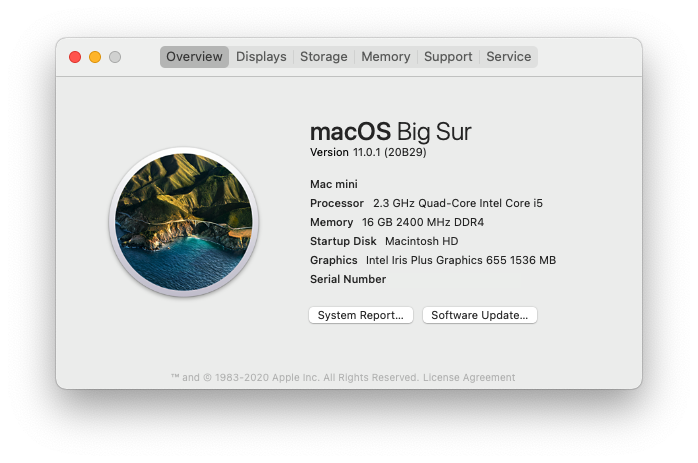
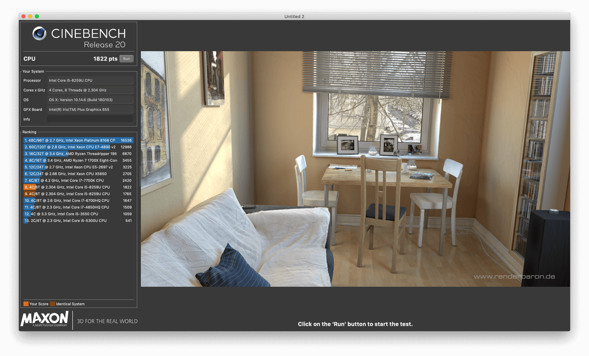

# NUC8I5BEH Hackintosh

This is the hackintosh for the NUC8I5BEH



## SPECS
+ OS: macOS 11.1 20C69 x86_64 / Macmini8,1
+ OpenCore: 0.6.5
+ CPU: Intel® Core™ i5-8259U Processor (6M Cache, up to 3.80 GHz)
+ SSD: 512GB [ADATA S11Pro NVME](https://union-click.jd.com/jdc?e=&p=AyIGZRprFQMTBlQeUhwDFABcKx9KWkxYZUIeUENQDEsFA1BWThgJBABAHUBZCQUdRUFGGRJDD1MdQlUQQwVKDFRXFk8jQA4SBlQaWhALGwZTHFIlUERQV1gbFHJ3BglDUmhCYXgWWQcLVB4LZRprFQMTB1MeXxwGEjdlG1wlVHwHVBpaFAMTAVUeaxQyEgNSEloWARMPVhhfETIVB1wrWxwBFQRWHV8VBhFpFCtrJQEiN2UbaxYyUGlVGlsWBBsDUh8PFwQXVwIaUxIEF1NSSQ9BBBQEAB1bFDIQBlQfUg%3D%3D)
+ RAM: 8GB x 2 [ADATA DDR4 2400](https://union-click.jd.com/jdc?e=&p=AyIGZRteEgYSAVEcWRQyEARSGV0RAxAFVR5rUV1KWQorAlBHU0VeBUVNR0ZbSkdETlcNVQtHRVNSUVNLXANBRA1XB14DS10cQQVYD21XHgVWHFkTBhMFVxteJUZOXRUcBEFXcl8NXxNSHBsHMEIPUnIeC2UaaxUDEwdTHl8cBhI3ZRtcJUN8B1QaWBEEEwFlGmsVBhUOVBhYFQoRAF0SaxICGzdVElgSAREBURtfFmxTN2UrWCUyIgdlGGtXbEdXBh5fQgEaAlJLDBAEFQ9cGAlFBkEPVUsMFQFCAldLaxcDEwNc)
+ BIOS: 0075
+ Monitor: [DELL U2518D](https://union-click.jd.com/jdc?e=&p=AyIGZRtaHAAaAFUdWh0yEQZdHVoTAhsCVRhrUV1KWQorAlBHU0VeBUVNR0ZbSkdETlcNVQtHRVNSUVNLXANBRA1XB14DS10cQQVYD21XHgRUE10UBBIOUBtYJV1KRgVPGRwHcEQraAlXQE9%2FIWs9ZmIeC2UaaxUDEwdTHl8cBhI3ZRtcJUN8AVYfWhIFIgZlG18TABIPVRpTEAsQBWUcWxwyEg5WHFgWBBYHURg1VDIiN1YrayUCIgRlWTVHVxQDB0lTHAMUDlYeUhECG1IGGAkcARZTVR1dHQcSAmUZWhQGGw%3D%3D)

## TELEGRAM
Please join Telegram [Join Telegram](https://t.me/hackintash), if you have any questions


## BIOS
+ Disable __Secure Boot__
+ Enable __Legacy Boot__
+ Disable __Wi-Fi and Bluetooth__


## Q&A

Soldered Wi-Fi and Bluetooth are not stable yet, will integrate later🍻

## Donating 💸

Feel free to [Buy Me a Coffee](https://www.buymeacoffee.com/csrutil) or  `15iEcYV1Xpr3xM4Ytyg9DCfcFwyifRFdQM`

## CINEBENCH


## macOS Tips

```
# https://gist.github.com/csrutil/b2cce932dda8b226f37be2880215aee6
sudo pmset -c sleep 30
sudo pmset -c displaysleep 30
sudo pmset -c disksleep 30
sudo pmset -c hibernatemode 0
sudo pmset -c standby 0
sudo pmset -c autopoweroff 0
sudo pmset -c tcpkeepalive 1

# disable the Spotlight indexes
sudo mdutil -a -i off

# change host name
sudo scutil --set HostName mini
sudo scutil --set ComputerName mini
sudo scutil --set LocalHostName mini

sudo spctl --master-disable
```

## CREDITS
- https://github.com/Sniki/OS-X-USB-Inject-All
- [acidanthera](https://github.com/acidanthera/OpenCorePkg)
- [OpenIntelWireless](https://github.com/OpenIntelWireless/itlwm)
- https://github.com/Rashed97/Intel-NUC-DSDT-Patch
- https://github.com/Rashed97/Intel-NUC-DSDT-Patch/commit/47476815b52f8e4c97e8f85df158c9ab1b6ecedd
- https://github.com/sarkrui/NUC8i7BEH-Hackintosh-Build
