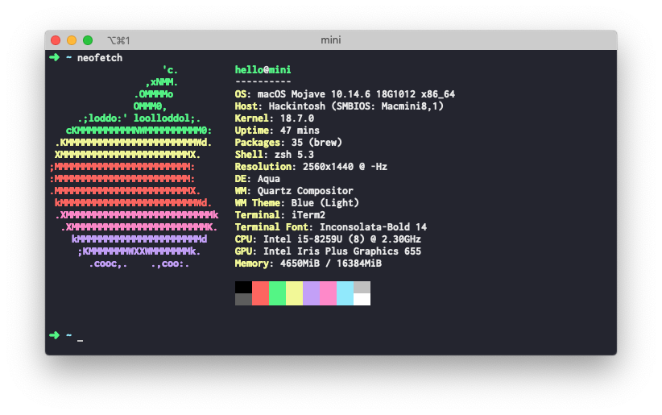
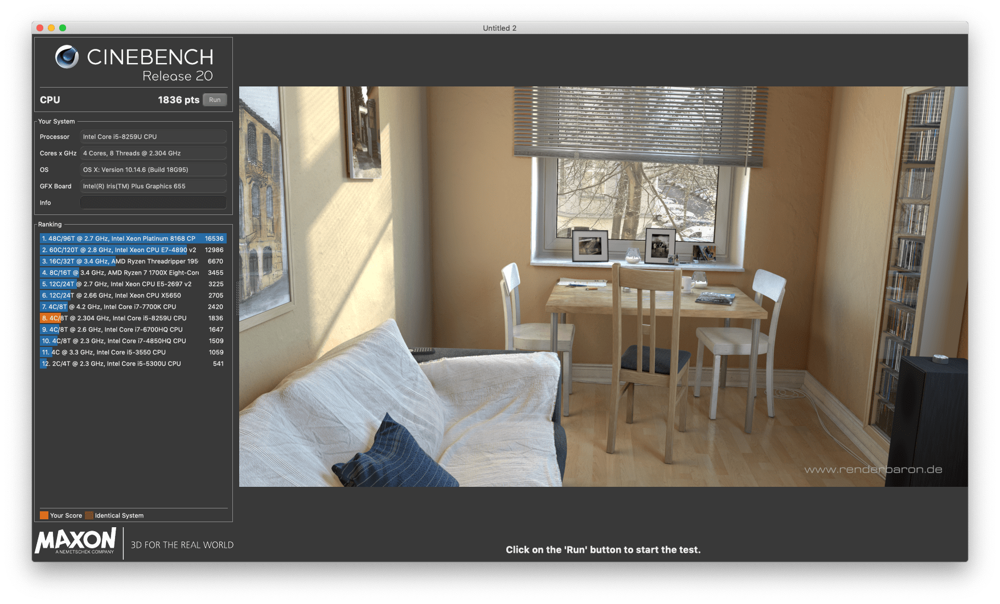

# NUC8I5BEH Hackintosh



### Specs

+ macOS: macOS Mojave 10.14.6 18G1012 x86_64 / Macmini8,1
+ CPU: Intel® Core™ i5-8259U Processor (6M Cache, up to 3.80 GHz)
+ SSD: 512GB [ADATA S11Pro NVME](https://union-click.jd.com/jdc?e=&p=AyIGZRprFQMTBlQeUhwDFABcKx9KWkxYZUIeUENQDEsFA1BWThgJBABAHUBZCQUdRUFGGRJDD1MdQlUQQwVKDFRXFk8jQA4SBlQaWhALGwZTHFIlUERQV1gbFHJ3BglDUmhCYXgWWQcLVB4LZRprFQMTB1MeXxwGEjdlG1wlVHwHVBpaFAMTAVUeaxQyEgNSEloWARMPVhhfETIVB1wrWxwBFQRWHV8VBhFpFCtrJQEiN2UbaxYyUGlVGlsWBBsDUh8PFwQXVwIaUxIEF1NSSQ9BBBQEAB1bFDIQBlQfUg%3D%3D)
+ RAM: 8GB x 2 [ADATA DDR4 2400](https://union-click.jd.com/jdc?e=&p=AyIGZRteEgYSAVEcWRQyEARSGV0RAxAFVR5rUV1KWQorAlBHU0VeBUVNR0ZbSkdETlcNVQtHRVNSUVNLXANBRA1XB14DS10cQQVYD21XHgVWHFkTBhMFVxteJUZOXRUcBEFXcl8NXxNSHBsHMEIPUnIeC2UaaxUDEwdTHl8cBhI3ZRtcJUN8B1QaWBEEEwFlGmsVBhUOVBhYFQoRAF0SaxICGzdVElgSAREBURtfFmxTN2UrWCUyIgdlGGtXbEdXBh5fQgEaAlJLDBAEFQ9cGAlFBkEPVUsMFQFCAldLaxcDEwNc)
+ BIOS: 0075
+ Monitor: [DELL U2518D](https://union-click.jd.com/jdc?e=&p=AyIGZRtaHAAaAFUdWh0yEQZdHVoTAhsCVRhrUV1KWQorAlBHU0VeBUVNR0ZbSkdETlcNVQtHRVNSUVNLXANBRA1XB14DS10cQQVYD21XHgRUE10UBBIOUBtYJV1KRgVPGRwHcEQraAlXQE9%2FIWs9ZmIeC2UaaxUDEwdTHl8cBhI3ZRtcJUN8AVYfWhIFIgZlG18TABIPVRpTEAsQBWUcWxwyEg5WHFgWBBYHURg1VDIiN1YrayUCIgRlWTVHVxQDB0lTHAMUDlYeUhECG1IGGAkcARZTVR1dHQcSAmUZWhQGGw%3D%3D)

### Bootloader
+ Clover 5070
+ OpenCore 0.5.2

### What's not working

+ Wi-Fi & bluetooth
+ eGPU hot swap

### How to install

+ Disable the Bluetooth/WiFi on the BIOS
+ Disable __Secure Boot__
+ Disable __Legacy Boot__
+ Create bootable USB with macOS Mojave
+ `git clone --depth https://github.com/csrutil/NUC8I5BEH`, copy EFI/OC_EFI to your USB EFI folder
+ Change your mac serial number

### Cinebench



### Tips

+ Change Host Name
	```
	sudo scutil --set HostName mini
	sudo scutil --set ComputerName mini
	sudo scutil --set LocalHostName mini
	```

+ Generate mac serial number https://chengxuxiaohei.cn/mac-sjsm.html

### credits

+ https://github.com/Rashed97/Intel-NUC-DSDT-Patch
+ https://github.com/Rashed97/Intel-NUC-DSDT-Patch/commit/47476815b52f8e4c97e8f85df158c9ab1b6ecedd
+ https://github.com/sarkrui/NUC8i7BEH-Hackintosh-Build
